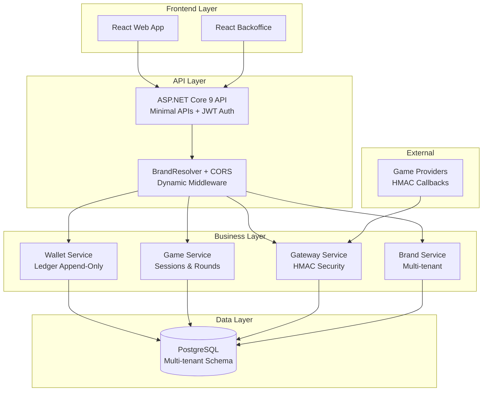

# Casino Platform - Guía Completa del Proyecto

## ?? **¿Qué es Casino Platform?**

Casino Platform es una **plataforma B2B de casino online con fichas virtuales** desarrollada con **.NET 9**, **PostgreSQL** y **React**. Está diseñada para operadores que quieren ofrecer servicios de casino a múltiples marcas (multi-tenant) con un wallet virtual seguro y integraciones con proveedores de juegos externos.

### ??? **Arquitectura del Sistema**



---

## ?? **Funcionalidades Principales**

### ?? **Multi-Tenancy**
- **Operadores**: Clientes B2B que poseen múltiples marcas
- **Marcas**: Sites individuales con dominios propios (ej: `casinoA.com`, `bet30test.netlify.app`)
- **Resolución Automática**: Cada dominio se resuelve automáticamente a su marca correspondiente

### ?? **Sistema de Usuarios**
- **Players**: Usuarios finales que juegan en las marcas
- **Backoffice Users**: Administradores con diferentes roles:
  - `SUPER_ADMIN`: Acceso total al sistema
  - `OPERATOR_ADMIN`: Gestión de marcas de su operador
  - `CASHIER`: Gestión de jugadores asignados

### ?? **Wallet Virtual**
- **Fichas virtuales**: Moneda interna manejada como enteros
- **Ledger append-only**: Historial inmutable de transacciones
- **Saldo nunca negativo**: Validación estricta de fondos
- **Idempotencia**: Transacciones únicas por `external_ref`

### ?? **Game Gateway**
- **Sesiones de juego**: Control de sesiones activas
- **Callbacks HMAC**: Seguridad en comunicaciones con proveedores
- **Bet/Win/Rollback**: Operaciones transaccionales estándar
- **Rounds**: Agrupación de transacciones por ronda de juego

### ?? **Autenticación Híbrida**
- **JWT + Cookies**: Soporte para SPAs y navegadores tradicionales
- **Separación por audiencia**: Admin (`backoffice`) y Player (`player`)
- **Múltiples esquemas**: Bearer tokens y cookies HttpOnly

---

## ??? **Modelo de Datos**

### **Entidades Principales**

```sql
-- Operadores (clientes B2B)
CREATE TABLE operators (
    id UUID PRIMARY KEY,
    name TEXT NOT NULL,
    status TEXT NOT NULL DEFAULT 'ACTIVE',
    created_at TIMESTAMP NOT NULL DEFAULT NOW()
);

-- Marcas (sites individuales)
CREATE TABLE brands (
    id UUID PRIMARY KEY,
    operator_id UUID REFERENCES operators(id),
    code TEXT UNIQUE NOT NULL,
    name TEXT NOT NULL,
    domain TEXT UNIQUE, -- Dominio principal (bet30test.netlify.app)
    admin_domain TEXT UNIQUE, -- Dominio admin (admin.bet30test.netlify.app)
    cors_origins TEXT[], -- Orígenes CORS permitidos
    theme JSONB,
    settings JSONB,
    status TEXT NOT NULL DEFAULT 'ACTIVE',
    created_at TIMESTAMP NOT NULL DEFAULT NOW()
);

-- Jugadores
CREATE TABLE players (
    id UUID PRIMARY KEY,
    brand_id UUID REFERENCES brands(id),
    external_id TEXT,
    username TEXT NOT NULL,
    email TEXT,
    status TEXT NOT NULL DEFAULT 'ACTIVE',
    created_at TIMESTAMP NOT NULL DEFAULT NOW(),
    UNIQUE(brand_id, username),
    UNIQUE(brand_id, external_id) NULLS NOT DISTINCT
);

-- Wallet (saldo por jugador)
CREATE TABLE wallets (
    player_id UUID PRIMARY KEY REFERENCES players(id),
    balance_bigint BIGINT NOT NULL DEFAULT 0
);

-- Ledger (historial append-only)
CREATE TABLE ledger (
    id BIGSERIAL PRIMARY KEY,
    operator_id UUID REFERENCES operators(id),
    brand_id UUID REFERENCES brands(id),
    player_id UUID REFERENCES players(id),
    delta_bigint BIGINT NOT NULL,
    reason TEXT NOT NULL, -- BET, WIN, BONUS, ADMIN_GRANT, etc.
    round_id UUID,
    game_code TEXT,
    provider TEXT,
    external_ref TEXT,
    meta JSONB,
    created_at TIMESTAMP NOT NULL DEFAULT NOW(),
    UNIQUE(external_ref) WHERE external_ref IS NOT NULL
);
```

---

## ?? **Cómo Usar el Sistema**

### **1. Configuración Inicial**

#### **Paso 1: Levantar Infrastructure**
```bash
# Levantar PostgreSQL
docker compose -f infra/docker-compose.yml up -d

# Migrar base de datos
dotnet ef database update --project apps/Casino.Infrastructure --startup-project apps/api/Casino.Api
```

#### **Paso 2: Configurar Autenticación**
```json
// appsettings.json
{
  "Auth": {
    "Issuer": "casino",
    "JwtKey": "REEMPLAZAR_POR_CLAVE_DE_32_O_MAS_CARACTERES_EN_PRODUCCION"
  },
  "ConnectionStrings": {
    "Default": "Host=localhost;Database=casino_platform;Username=postgres;Password=postgres"
  }
}
```

#### **Paso 3: Ejecutar la API**
```bash
dotnet watch --project apps/api/Casino.Api
```

La API estará disponible en: `http://localhost:5000`  
Swagger UI disponible en: `http://localhost:5000`

### **2. Autenticación**

#### **Login Admin**
```bash
curl -X POST -H "Host: admin.bet30test.netlify.app" \
     -H "Content-Type: application/json" \
     -d '{"username":"superadmin","password":"password123"}' \
     http://localhost:5000/api/v1/admin/auth/login
```

#### **Login Player**
```bash
curl -X POST -H "Host: bet30test.netlify.app" \
     -H "Content-Type: application/json" \
     -d '{"username":"player1_bet30","password":"demo"}' \
     http://localhost:5000/api/v1/auth/login
```

### **3. Testing Game Gateway (HMAC)**

#### **Generar HMAC Signature**
```bash
# Ejemplo en bash (requiere openssl)
PROVIDER="dummy"
SECRET="your-hmac-secret-key"
PAYLOAD='{"sessionId":"550e8400-e29b-41d4-a716-446655440000","playerId":"123","amount":1000,"roundId":"550e8400-e29b-41d4-a716-446655440001","txId":"tx_001"}'

SIGNATURE=$(echo -n "$PAYLOAD" | openssl dgst -sha256 -hmac "$SECRET" -binary | base64)

curl -X POST http://localhost:5000/api/v1/gateway/bet \
     -H "Content-Type: application/json" \
     -H "X-Provider: $PROVIDER" \
     -H "X-Signature: $SIGNATURE" \
     -d "$PAYLOAD"
```

---

## ?? **Cómo Crear un Nuevo Site (Marca)**

### **Requisitos Completos para un Nuevo Site**

Para crear un site completamente funcional, necesitas:

1. ? **Operador** (tabla `operators`)
2. ? **Marca** (tabla `brands`) con dominio configurado
3. ? **Juegos** (tabla `games` + `brand_games`) 
4. ? **Usuarios Admin** (tabla `backoffice_users`)
5. ? **Jugadores** (tabla `players` + `wallets`)
6. ? **Configuración de Proveedores** (tabla `brand_provider_configs`)

### **Proceso Paso a Paso**

#### **Paso 1: Crear Operador**
```bash
# ? IMPLEMENTADO - Endpoint disponible
# POST /api/v1/admin/operators
curl -X POST -H "Authorization: Bearer <SUPER_ADMIN_JWT>" \
     -H "Content-Type: application/json" \
     -d '{"name": "Mi Casino Corp", "status": "ACTIVE"}' \
     http://localhost:5000/api/v1/admin/operators
```

#### **Paso 2: Crear Marca**
```bash
curl -X POST -H "Authorization: Bearer <ADMIN_JWT>" \
     -H "Content-Type: application/json" \
     -d '{
       "operatorId": "operator-uuid",
       "code": "mycasino",
       "name": "Mi Casino Online",
       "domain": "mycasino.com",
       "adminDomain": "admin.mycasino.com",
       "corsOrigins": ["https://mycasino.com", "https://admin.mycasino.com"],
       "locale": "es-ES",
       "theme": {
         "primaryColor": "#FF6B35",
         "logo": "https://mycasino.com/logo.png"
       },
       "settings": {
         "allowRegistration": true,
         "maxBetAmount": 100000,
         "currency": "EUR"
       }
     }' \
     http://localhost:5000/api/v1/admin/brands
```

#### **Paso 3: Configurar Juegos para la Marca**
```bash
# ? IMPLEMENTADO - Endpoint disponible
# POST /api/v1/admin/brands/{brandId}/games
curl -X POST -H "Authorization: Bearer <ADMIN_JWT>" \
     -H "Content-Type: application/json" \
     -d '{"gameId": "game-uuid", "enabled": true, "displayOrder": 1, "tags": ["slots", "popular"]}' \
     http://localhost:5000/api/v1/admin/brands/{brandId}/games
```

#### **Paso 4: Crear Usuario Admin de la Marca**
```bash
# ? IMPLEMENTADO - Endpoint disponible
# POST /api/v1/admin/users
curl -X POST -H "Authorization: Bearer <SUPER_ADMIN_JWT>" \
     -H "Content-Type: application/json" \
     -d '{"username": "admin_mycasino", "password": "SecurePass123!", "role": "OPERATOR_ADMIN", "operatorId": "operator-uuid"}' \
     http://localhost:5000/api/v1/admin/users
```

#### **Paso 5: Configurar Proveedor HMAC**
```bash
curl -X PUT -H "Authorization: Bearer <ADMIN_JWT>" \
     -H "Content-Type: application/json" \
     -d '{
       "secret": "mycasino-hmac-secret-key-256bit",
       "allowNegativeOnRollback": false,
       "meta": {
         "environment": "production",
         "webhookUrl": "https://provider.example.com/webhook"
       }
     }' \
     http://localhost:5000/api/v1/admin/brands/{brandId}/providers/dummy
```

#### **Paso 6: Crear Jugadores de Prueba**
```bash
# ? IMPLEMENTADO - Endpoint disponible
# POST /api/v1/admin/players
curl -X POST -H "Authorization: Bearer <ADMIN_JWT>" \
     -H "Content-Type: application/json" \
     -d '{"brandId": "brand-uuid", "username": "player1", "email": "player1@mycasino.com", "initialBalance": 100000}' \
     http://localhost:5000/api/v1/admin/players
```

### **?? Endpoints Faltantes para Crear un Site Completo**

~~Los siguientes endpoints **NO ESTÁN IMPLEMENTADOS** y son necesarios:~~

**? TODOS LOS ENDPOINTS ESTÁN AHORA IMPLEMENTADOS:**

1. **Gestión de Operadores**
   - `POST /api/v1/admin/operators` - ? **IMPLEMENTADO**
   - `GET /api/v1/admin/operators` - ? **IMPLEMENTADO** 
   - `PATCH /api/v1/admin/operators/{id}` - ? **IMPLEMENTADO**

2. **Gestión de Juegos a Nivel Global**
   - `POST /api/v1/admin/games` - ? **IMPLEMENTADO**
   - `GET /api/v1/admin/games` - ? **IMPLEMENTADO**

3. **Asignación de Juegos a Marcas**
   - `POST /api/v1/admin/brands/{brandId}/games` - ? **IMPLEMENTADO**
   - `DELETE /api/v1/admin/brands/{brandId}/games/{gameId}` - ? **IMPLEMENTADO**
   - `PATCH /api/v1/admin/brands/{brandId}/games/{gameId}` - ? **IMPLEMENTADO**

4. **Gestión de Usuarios Backoffice**
   - `POST /api/v1/admin/users` - ? **IMPLEMENTADO**
   - `GET /api/v1/admin/users` - ? **IMPLEMENTADO**
   - `PATCH /api/v1/admin/users/{id}` - ? **IMPLEMENTADO**

5. **Gestión de Jugadores**
   - `POST /api/v1/admin/players` - ? **IMPLEMENTADO**
   - `GET /api/v1/admin/players` - ? **IMPLEMENTADO**
   - `PATCH /api/v1/admin/players/{id}/status` - ? **IMPLEMENTADO**
   - `POST /api/v1/admin/players/{id}/wallet/adjust` - ? **IMPLEMENTADO**

6. **Gestión de Sesiones de Juego**
   - `POST /api/v1/catalog/games/{code}/launch` - ? **IMPLEMENTADO**
   - `POST /api/v1/admin/sessions/close-expired` - ? **OPCIONAL** (para el futuro)

---

## ?? **Endpoints Disponibles**

### **?? Públicos (Sin Autenticación)**

#### **Gateway (HMAC Protegido)**
- `POST /api/v1/gateway/balance` - Consultar saldo
- `POST /api/v1/gateway/bet` - Realizar apuesta
- `POST /api/v1/gateway/win` - Procesar ganancia
- `POST /api/v1/gateway/rollback` - Revertir transacción
- `POST /api/v1/gateway/closeRound` - Cerrar ronda

#### **Catálogo Público**
- `GET /api/v1/catalog/games` - Listar juegos (brand-scoped)
- `POST /api/v1/catalog/games/{code}/launch` - Lanzar juego

#### **Autenticación**
- `POST /api/v1/admin/auth/login` - Login admin
- `POST /api/v1/auth/login` - Login player

### **?? Protegidos - Admin (Backoffice)**

#### **Autenticación Admin**
- `GET /api/v1/admin/auth/me` - Perfil admin actual
- `POST /api/v1/admin/auth/logout` - Logout admin

#### **Gestión de Marcas**
- `POST /api/v1/admin/brands` - Crear marca
- `GET /api/v1/admin/brands` - Listar marcas
- `GET /api/v1/admin/brands/{id}` - Obtener marca
- `PATCH /api/v1/admin/brands/{id}` - Actualizar marca
- `DELETE /api/v1/admin/brands/{id}` - Eliminar marca
- `POST /api/v1/admin/brands/{id}/status` - Cambiar status
- `GET /api/v1/admin/brands/by-host/{host}` - Buscar por host
- `GET /api/v1/admin/brands/{id}/catalog` - Catálogo de la marca

#### **Configuración de Marcas**
- `GET /api/v1/admin/brands/{id}/settings` - Obtener configuración
- `PUT /api/v1/admin/brands/{id}/settings` - Reemplazar configuración
- `PATCH /api/v1/admin/brands/{id}/settings` - Actualizar configuración parcial

#### **Configuración de Proveedores**
- `GET /api/v1/admin/brands/{id}/providers` - Listar proveedores
- `PUT /api/v1/admin/brands/{id}/providers/{code}` - Configurar proveedor
- `POST /api/v1/admin/brands/{id}/providers/{code}/rotate-secret` - Rotar secreto

#### **Gestión de Juegos**
- `GET /api/v1/admin/games` - Listar juegos globales
- `POST /api/v1/admin/games` - Crear juego

#### **Gestión de Jugadores**
- `GET /api/v1/admin/players` - Listar jugadores
- `PATCH /api/v1/admin/players/{id}/status` - Cambiar status jugador

#### **Wallet Interno**
- `POST /api/v1/admin/wallet/balance` - Consultar saldo
- `POST /api/v1/admin/wallet/debit` - Débito interno
- `POST /api/v1/admin/wallet/credit` - Crédito interno
- `POST /api/v1/admin/wallet/rollback` - Rollback interno

#### **Sesiones y Rondas**
- `POST /api/v1/admin/sessions` - Crear sesión
- `GET /api/v1/admin/sessions/{id}` - Obtener sesión
- `POST /api/v1/admin/sessions/{id}/close` - Cerrar sesión
- `POST /api/v1/admin/rounds` - Crear ronda
- `POST /api/v1/admin/rounds/{id}/close` - Cerrar ronda

### **?? Protegidos - Player**

#### **Autenticación Player**
- `GET /api/v1/auth/me` - Perfil player actual
- `POST /api/v1/auth/logout` - Logout player

---

## ?? **Estado Actual del Proyecto**

### ? **Implementado (100%)**
- **Autenticación híbrida JWT + Cookies**
- **Multi-tenancy con resolución por Host**
- **Wallet virtual con ledger append-only**
- **Game Gateway con seguridad HMAC**
- **Gestión completa de marcas**
- **Configuración de proveedores por marca**
- **Catálogo público de juegos**
- **Lanzamiento de sesiones de juego**
- **Auditoría de acciones admin y proveedor**
- **Gestión completa de operadores** ? **NUEVO**
- **Gestión completa de usuarios backoffice** ? **NUEVO**
- **Creación de jugadores con balance inicial** ? **NUEVO**
- **Ajustes de wallet por admin/cajero** ? **NUEVO**
- **Asignación de juegos a marcas** ? **NUEVO**

### ?? **Parcialmente Implementado**
- ~~**Gestión de jugadores** (falta creación y ajustes de wallet)~~ ? **COMPLETADO**
- ~~**Gestión de juegos** (falta asignación a marcas)~~ ? **COMPLETADO**

### ? **Faltante para Producción**
- ~~**Gestión de operadores** (CRUD completo)~~ ? **COMPLETADO**
- ~~**Gestión de usuarios backoffice** (CRUD completo)~~ ? **COMPLETADO**
- ~~**Creación de jugadores desde backoffice**~~ ? **COMPLETADO**
- ~~**Ajustes de wallet por admin/cajero**~~ ? **COMPLETADO**
- **Asignación cajero ? jugadores** (para implementar en el futuro)
- **Dashboard de reportes y KPIs** (para implementar en el futuro)
- **Gestión de sesiones expiradas** (para implementar en el futuro)
- **Password hashing para players** (recomendado para producción)
- **Rate limiting en endpoints críticos** (recomendado para producción)
- **Refresh tokens** (recomendado para producción)

---

## ?? **Ventajas del Sistema**

### ?? **Seguridad Robusta**
- Autenticación separada admin/player
- Cookies HttpOnly + Bearer tokens
- Firmas HMAC en game gateway
- Validaciones de negocio estrictas

### ?? **Multi-Site Ready**
- Resolución automática por dominio
- CORS dinámico por marca
- Configuración aislada por site
- Temas y settings personalizables

### ?? **Wallet Confiable**
- Ledger inmutable (append-only)
- Idempotencia estricta
- Saldo nunca negativo
- Auditoría completa

### ?? **Game Integration**
- Estándar de proveedores
- Sesiones y rondas controladas
- Callbacks seguros HMAC
- Soporte para rollbacks

### ??? **Arquitectura Escalable**
- Clean Architecture
- Minimal APIs performantes
- Servicios inyectados
- Logs estructurados

---

## ?? **Próximos Pasos Recomendados**

### **Prioridad Alta**
1. **Implementar gestión de operadores** (CRUD completo)
2. **Completar gestión de usuarios backoffice**
3. **Añadir creación de jugadores con wallet inicial**
4. **Implementar ajustes de wallet por admin**
5. **Password hashing para players**

### **Prioridad Media**
1. **Dashboard de reportes básicos**
2. **Gestión de sesiones expiradas**
3. **Rate limiting en autenticación**
4. **Relación cajero ? jugadores**

### **Prioridad Baja**
1. **Refresh tokens**
2. **2FA para admins**
3. **Integración con proveedores reales**
4. **Frontend React completo**

---

## ?? **Recursos Adicionales**

- **Swagger UI**: `http://localhost:5000` (cuando la API esté corriendo)
- **Base de datos**: PostgreSQL en `localhost:5432` (docker)
- **Logs**: Estructurados con correlation IDs
- **Tests**: Cobertura en servicios críticos (wallet, gateway)

**¡El sistema está listo para desarrollo activo con una base sólida y arquitectura escalable! ???**